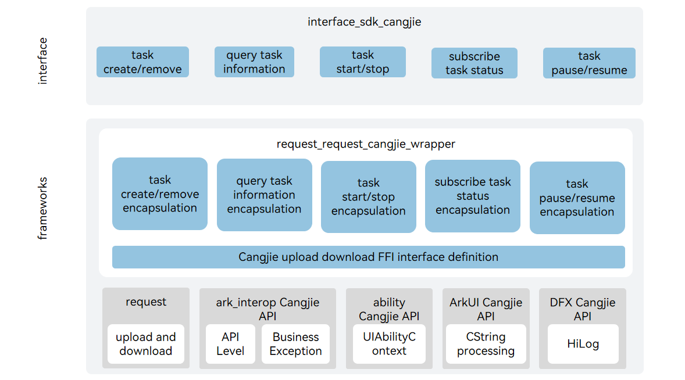

# request_cangjie_wrapper

## Introduction

The request_cangjie_wrapper is a Cangjie API encapsulated on OpenHarmony based on the capabilities of the upload and download subsystem. The upload and download subsystem provides upload and download capabilities for applications, including creating, removing, suspending, and starting upload and download tasks, and subscribing to the task progress and result.

## System Architecture

**Figure 1** Architecture of the request_cangjie_wrapper



## Directory Structure

The source code of the upload and download subsystem is stored in the **/base/request** directory.

The directory structure is as follows:

```
base/request/request_cangjie_wrapper
├── ohos             # Cangjie Upload and Download code
├── figures          # architecture pictures
```

## Constraint

- The currently Cangjie open interface for uploading and downloading only supports standard devices.

- If you need to use the request service, you need to apply for the following permissions: 
     ohos.permission.INTERNET

- The data unit is in file form, and the rest of the data forms need to be encapsulated by the caller into file paths by themselves. 

- The request service does not provide a complete HTTP/HTTPS SDK interface. It is only for users of the HTTP/HTTPS SDK. If you need this interface, it is recommended to use [netmanager](https://gitcode.com/openharmony-sig/netmanager_netmanager_cangjie_wrapper). 

- The download server must support the head method of the HTTP protocol and be able to obtain the size of the download data through Content-length; otherwise, the download task will fail. 

- When downloading, if the user specifies that the file already exists, it will be verified when creating the task and an exception will be thrown, resulting in the failure of task creation. 

- Allow users to specify a successful multi-file upload strategy: When multiple files are uploaded in the same task, the task dimension is used as the judgment criterion. All files must be uploaded successfully to be considered successful.

## Instructions For Use

The following upload and download functions are provided:

- Create a task to upload or download. 
- Query the task based on the task id. 
- Remove the specified task belonging to the caller. 
- Search for task id.
- Based on the default Filter conditions. Search for task id.
- Based on the Filter conditions. Query the detailed information of the task based on the task id. 
- Query the detailed information of the task based on the task id and token. 
- Events for subscribing to/unsubscribing tasks.
- Start/Stop/Pause/restart tasks.

Compared with ArkTS, the following functions are temporarily not supported:

- Create and start an upload task. 
- Create and start a download task. 
- Set the upper limit of bytes that the task can transfer per second. 
- Reasons for the failure of the subscription/unsubscription task. 
- Reasons for waiting for the subscription/unsubscription task.

For the request APIs, please refer to [ohos.request](https://gitcode.com/openharmony-sig/arkcompiler_cangjie_ark_interop/blob/master/doc/API_Reference/source_en/apis/BasicServicesKit/cj-apis-request-agent.md). For relevant guidance, please refer to [Application File Upload and Download Guide](https://gitcode.com/openharmony-sig/arkcompiler_cangjie_ark_interop/blob/master/doc/Dev_Guide/source_en/basic-services/request/cj-app-file-upload-download.md).

## Code Contribution

Developers are welcome to contribute code, documentation, etc. For specific contribution processes and methods, please refer to [Code Contribution](https://gitcode.com/openharmony/docs/blob/master/en/contribute/code-contribution.md).

## Repositories Involved

[request_request](https://gitee.com/openharmony/request_request/blob/master/README.md)


