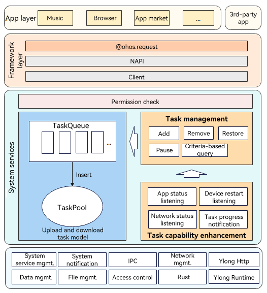

# Upload and Download Subsystem

## Introduction

The upload and download subsystem provides upload and download capabilities for applications, including creating, removing, suspending, and starting upload and download tasks, and subscribing to the task progress and result.


## System Architecture

**Figure 1** Architecture of the upload and download subsystem




## Directory Structure

The source code of the upload and download subsystem is stored in the **/base/request** directory.

The directory structure is as follows:

```
base/request/request_cangjie_api
├── ohos             # Cangjie Upload and Download code
├── figures          # architecture pictures
```

## Repositories Involved

request_cangjie_api

[request_request](https://gitee.com/openharmony/request_request)
