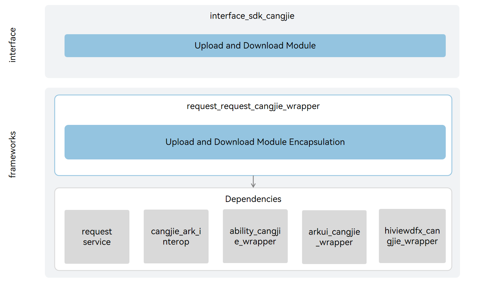

# Upload/Download Cangjie Wrapper

## Introduction

The Upload/Download Cangjie Wrapper provides upload/download capabilities for developers using the Cangjie language for application development on OpenHarmony. The current upload/download Cangjie wrapper supports standard devices. The Cangjie upload/download wrapper provides applications with complete upload/download capabilities, covering core operations such as task creation, removal, pausing, and starting. It also supports subscribing to task progress, success, and failure status changes, helping developers conveniently and efficiently implement upload/download business functions.

## System Architecture

**Figure 1** Upload/Download Cangjie Architecture



As shown in the architecture diagram:

Interface Layer

- Task Creation/Removal: Provides developers with the ability to create and remove upload/download tasks.
- Query Task Information: Provides developers with the ability to query upload/download task information.
- Task Start/Stop: Provides developers with the ability to start and stop created upload/download tasks.
- Subscribe to Task Status: Provides developers with the ability to subscribe to task status interfaces, triggering callbacks when task status changes.
- Task Interrupt/Resume: Provides developers with the ability to interrupt an executing upload/download task and resume an interrupted upload/download task.

Framework Layer

- Task Creation/Removal Function Encapsulation: Based on the task creation and removal capabilities provided by the underlying request service, implements the function of creating and removing upload/download tasks in Cangjie.
- Query Task Information Function Encapsulation: Based on the task information query capabilities provided by the underlying request service, implements the function of querying upload/download task information in Cangjie.
- Task Start/Stop Function Encapsulation: Based on the task start and stop capabilities provided by the underlying request service, implements the function of starting and stopping created upload/download tasks in Cangjie.
- Subscribe to Task Status Function Encapsulation: Based on the task subscription capabilities provided by the underlying request service, implements the function of subscribing to task status interfaces in Cangjie.
- Task Interrupt/Resume Function Encapsulation: Based on the task interrupt and resume capabilities provided by the underlying request service, implements the function of task interruption and resumption in Cangjie.

Dependency Component Introduction in Architecture Diagram

- request: Responsible for providing basic upload/download functionality, encapsulating C language interfaces for interoperability with Cangjie.
- cangjie_ark_interop: Responsible for providing Cangjie annotation class definitions for API annotation, and providing BusinessException exception class definitions thrown to users.
- ability_cangjie_wrapper: Responsible for providing basic capabilities of Ability or Application context, including accessing specific application resources.
- arkui_cangjie_wrapper: Responsible for providing basic type definitions, providing the ability to convert CString type to String type.
- hiviewdfx_cangjie_wrapper: Responsible for providing log interfaces for printing logs at critical paths.

## Directory

```
base/request/request_cangjie_wrapper
├── figures            # Architecture diagrams in README         
├── ohos
│   └── request        # Cangjie upload/download interface implementation
└── test
    └── request        # Cangjie upload/download interface test code
```

## Usage Instructions

Provides the following upload/download functions:

- Create upload or download tasks
- Query tasks by task ID
- Remove specified tasks belonging to the caller
- Find task IDs based on default Filter conditions
- Find task IDs based on Filter conditions
- Query detailed task information by task ID
- Query detailed task information by task ID and token
- Subscribe/unsubscribe to task events
- Start/stop/pause/restart tasks

For request-related APIs, please refer to [Upload/Download API Reference](https://gitcode.com/openharmony-sig/arkcompiler_cangjie_ark_interop/blob/master/doc/API_Reference/source_en/apis/BasicServicesKit/cj-apis-request-agent.md). For related guidance, please refer to [Upload/Download Development Guide](https://gitcode.com/openharmony-sig/arkcompiler_cangjie_ark_interop/blob/master/doc/Dev_Guide/source_en/basic-services/request/cj-app-file-upload-download.md).

## Constraints

- To use the request service, the ohos.permission.INTERNET permission must be requested.
- Request data units are in file form. Other data forms need to be encapsulated as file paths by the caller.
- The request service does not provide complete HTTP/HTTPS interfaces. If complete HTTP/HTTPS interfaces are needed, it is recommended to use [netmanager](https://gitcode.com/openharmony-sig/netmanager_netmanager_cangjie_wrapper/blob/master/README.md).
- The download server must support the HTTP protocol's head method and be able to obtain the download data size through Content-length, otherwise the download task will fail.
- If the user-specified file already exists during download, it will be verified during task creation and an exception will be thrown, causing task creation to fail.
- Allows users to specify multi-file upload success policies: multiple files are uploaded in the same task, with the task dimension as the judgment standard. All files must be successfully uploaded to determine success.
- Each application supports creating up to 10 unfinished tasks at most.
- Compared to APIs provided by ArkTS, the following functions are not currently supported:
  - Create and start an upload task
  - Create and start a download task
  - Set the upper limit of bytes that can be transmitted per second for tasks
  - Subscribe/unsubscribe to task failure reasons
  - Subscribe/unsubscribe to task waiting reasons

## Contribution

Developers are welcome to contribute code, documentation, etc. For specific contribution processes and methods, please refer to [Contribution](https://gitcode.com/openharmony/docs/blob/master/en/contribute/how-to-contribute.md).

## Related Repositories

[request_request](https://gitcode.com/openharmony/request_request/blob/master/README.md)

[cangjie_ark_interop](https://gitcode.com/openharmony-sig/arkcompiler_cangjie_ark_interop/blob/master/README.md)

[ability_cangjie_wrapper](https://gitcode.com/openharmony-sig/ability_ability_cangjie_wrapper/blob/master/README.md)

[arkui_cangjie_wrapper](https://gitcode.com/openharmony-sig/arkui_arkui_cangjie_wrapper/blob/master/README.md)

[hiviewdfx_cangjie_wrapper](https://gitcode.com/openharmony-sig/hiviewdfx_hiviewdfx_cangjie_wrapper/blob/master/README.md)
