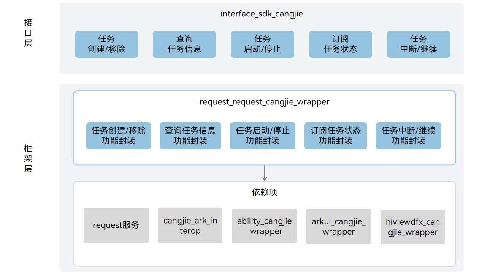

# 上传下载仓颉接口

## 简介

上传下载仓颉接口是在 OpenHarmony 上基于上传下载子系统能力之上封装的仓颉API。上传下载服务为应用提供上传/下载能力，包括创建、移除、暂停、启动任务上传/下载，以及订阅任务进度、成功、失败等，支撑开发者方便、高效地使用下载/上传业务的功能，当前开放的上传下载仓颉接口仅支持standard设备。

## 系统架构

**图 1**  上传下载仓颉架构图



## 目录

上传下载仓颉源代码在/base/request目录下。

目录结构如下所示：

```
base/request/request_cangjie_wrapper
├── ohos             # 仓颉上传下载仓颉接口实现
├── figures          # 存放README中的架构图
```

## 约束

- 如需使用request服务，需要申请如下权限：
    ohos.permission.INTERNET

- request数据单元为文件形式，其余数据形式需要调用者自行封装为文件路径。

- request服务不提供完整的HTTP/HTTPS SDK接口，只是HTTP/HTTPS SDK 的用户，如需此接口推荐使用[netmanager](https://gitcode.com/openharmony-sig/netmanager_netmanager_cangjie_wrapper)。

- 下载服务器需要支持HTTP协议的head方法，能够通过Content-length获取下载数据大小，否则下载任务失败。

- 下载时用户指定文件已存在，会在创建任务时校验并抛出异常，创建任务失败。

- 允许用户指定多文件上传成功策略：多文件在同一个任务中上传，以任务维度为判断标准，必须所有文件上传成功判定为成功。

## 使用说明

提供以下上传下载功能：

- 创建要上传或下载的任务
- 根据任务id查询任务
- 移除属于调用方的指定任务
- 根据默认Filter过滤条件查找任务id
- 根据Filter过滤条件查找任务id
- 根据任务id查询任务的详细信息。
- 根据任务id和token查询任务的详细信息。
- 订阅/取消订阅任务的事件
- 启动/停止/暂停/重启任务

与ArkTS相比，暂不支持以下功能：

- 创建并启动一个上传任务
- 创建并启动一个下载任务
- 设置任务每秒能传输的字节数上限
- 订阅/取消订阅任务失败原因
- 订阅/取消订阅任务等待原因

request相关API请参见[ohos.request](https://gitcode.com/openharmony-sig/arkcompiler_cangjie_ark_interop/blob/master/doc/API_Reference/source_zh_cn/apis/BasicServicesKit/cj-apis-request-agent.md)，相关指导请参见[应用文件上传下载开发指南](https://gitcode.com/openharmony-sig/arkcompiler_cangjie_ark_interop/blob/master/doc/Dev_Guide/source_zh_cn/basic-services/request/cj-app-file-upload-download.md)。

## 参与贡献

欢迎广大开发者贡献代码、文档等，具体的贡献流程和方式请参见[参与贡献](https://gitcode.com/openharmony/docs/blob/master/zh-cn/contribute/%E5%8F%82%E4%B8%8E%E8%B4%A1%E7%8C%AE.md)。

## 相关仓

[request_request](https://gitee.com/openharmony/request_request/tree/master)
[arkcompiler_cangjie_ark_interop](https://gitcode.com/openharmony-sig/arkcompiler_cangjie_ark_interop/tree/master)
[arkui_arkui_cangjie_wrapper](https://gitcode.com/openharmony-sig/arkui_arkui_cangjie_wrapper/tree/master)
[hiviewdfx_hiviewdfx_cangjie_wrapper](https://gitcode.com/openharmony-sig/hiviewdfx_hiviewdfx_cangjie_wrapper/tree/master)
[ability_ability_cangjie_wrapper](https://gitcode.com/openharmony-sig/ability_ability_cangjie_wrapper/tree/master)
