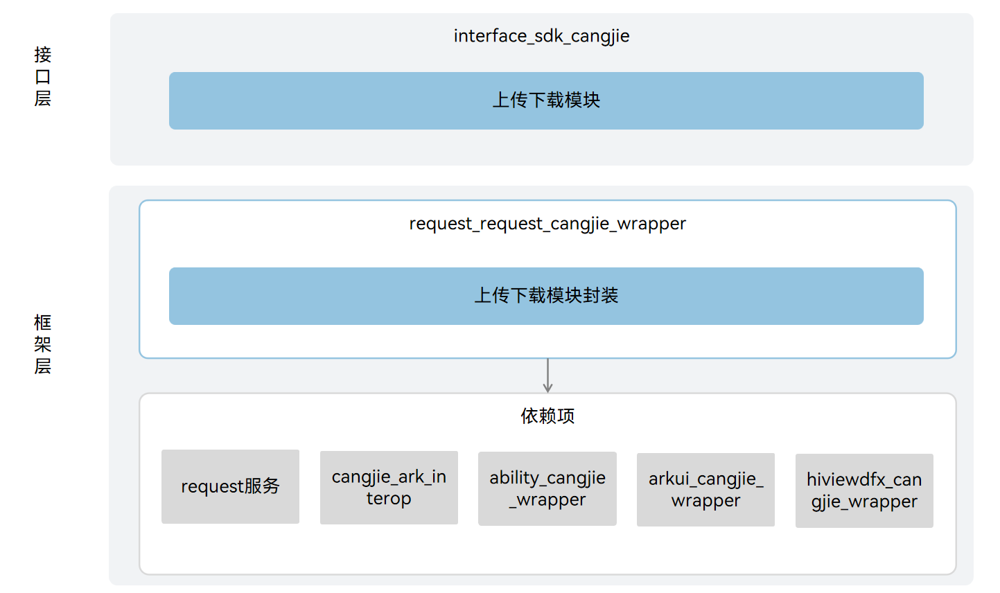

# 上传下载仓颉

## 简介

上传下载服务为应用提供上传/下载能力，包括创建、移除、暂停、启动任务上传/下载，以及订阅任务进度、成功、失败等，支撑开发者方便、高效地使用下载/上传业务的功能。


## 系统架构

**图 1**  上传下载仓颉架构图




## 目录

上传下载仓颉源代码在/base/request目录下。

目录结构如下所示：

```
base/request/request_cangjie_wrapper
├── ohos             # 仓颉上传下载仓颉接口实现
├── figures          # 存放readme中的架构图
```

## 相关仓

request_cangjie_wrapper

[request_request](https://gitee.com/openharmony/request_request)
